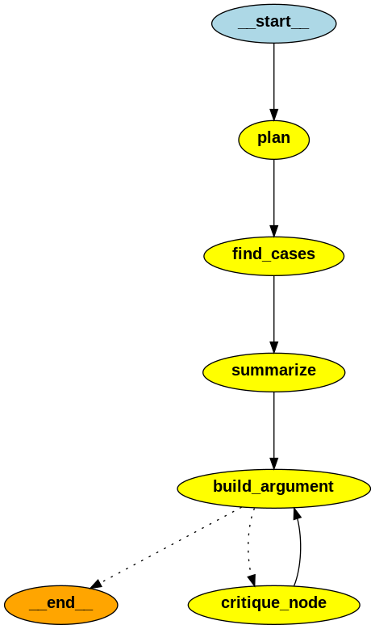

# Legal Research Agent (legal-research-ai)

A sophisticated AI-powered legal research assistant that helps users conduct legal research, analyze cases, and draft legal arguments. The agent uses a state-of-the-art language model and web search capabilities to provide comprehensive legal research support.

## Features

- Legal research planning
- Case law and statute search
- Legal source summarization
- Legal argument drafting
- Expert critique and feedback
- Interactive web interface

## Agent Flow

The agent follows a structured flow using LangGraph for state management. Here's a visual representation of the agent's workflow:



The graph shows how the agent processes legal research tasks through different states:
1. Research Planning
2. Source Finding
3. Source Summarization
4. Argument Building
5. Critique and Revision

## Prerequisites

- Python 3.11 or higher
- OpenAI API key
- Tavily API key

## Installation

1. Clone the repository:
```bash
git clone https://github.com/yourusername/legal-research-ai.git
cd legal-research-ai
```

2. Install the required dependencies:
```bash
pip install -r requirements.txt
```

3. Set up environment variables:
Create a `.env` file in the project root with the following variables:
```
OPENAI_API_KEY=your_openai_api_key
TAVILY_API_KEY=your_tavily_api_key
```

## Usage

1. Start the application:
```bash
python agent.py
```

2. Open your web browser and navigate to the provided URL (typically http://localhost:8080)

3. Use the interface to:
   - Enter legal questions
   - Generate research plans
   - Search for legal sources
   - Draft legal arguments
   - Receive expert critique

## Project Structure

- `agent.py`: Main agent implementation with state graph and node functions
- `helper.py`: Helper functions and GUI implementation
- `requirements.txt`: Project dependencies
- `README.md`: Project documentation
- `.env`: Environment variables (not tracked in git)
- `.gitignore`: Git ignore rules

## How It Works

The agent uses a state graph to manage the legal research process:

1. **Research Planning**: Creates a detailed research plan based on the legal question
2. **Source Finding**: Searches for relevant legal sources using the research plan
3. **Source Summarization**: Summarizes found legal sources
4. **Argument Building**: Drafts a legal argument using the research and summaries
5. **Critique**: Provides expert feedback on the argument
6. **Revision**: Iteratively improves the argument based on feedback

## Contributing

1. Fork the repository
2. Create your feature branch (`git checkout -b feature/AmazingFeature`)
3. Commit your changes (`git commit -m 'Add some AmazingFeature'`)
4. Push to the branch (`git push origin feature/AmazingFeature`)
5. Open a Pull Request

## License

This project is licensed under the MIT License - see the [LICENSE](LICENSE) file for details.

## Acknowledgments

- OpenAI for providing the language model
- Tavily for the search API
- LangGraph for the state management framework 